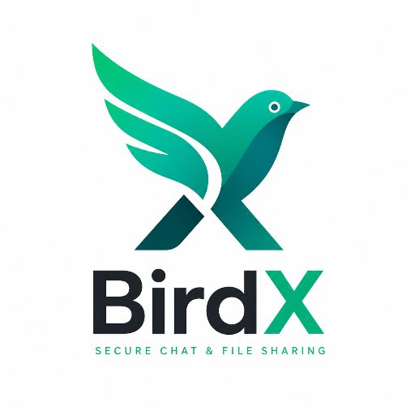
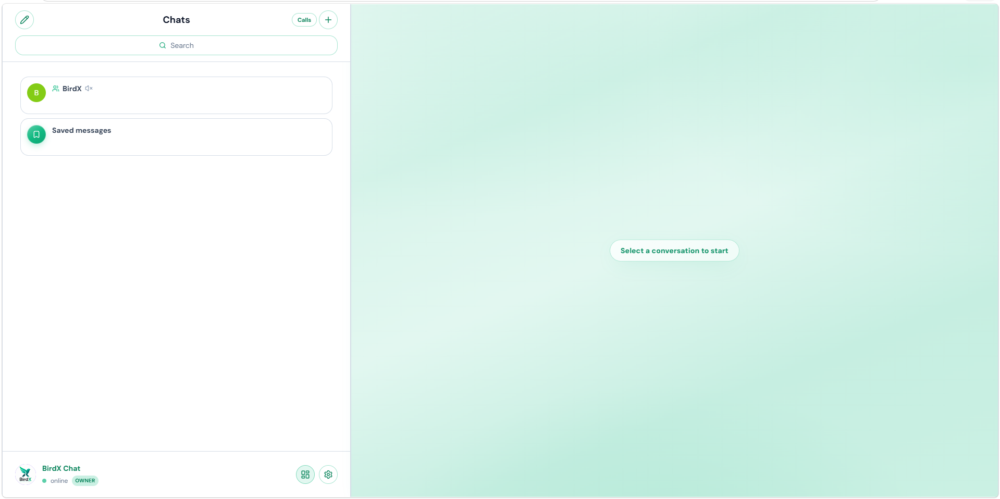
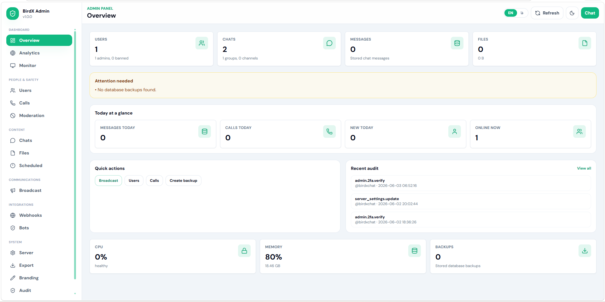
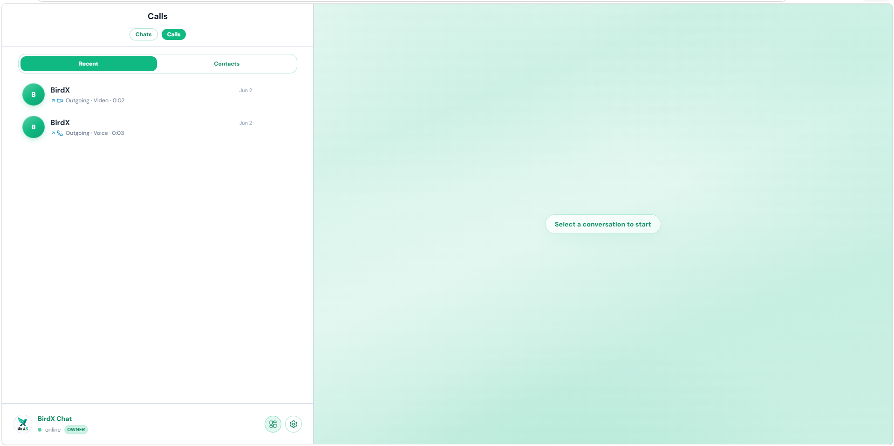

<p align="center">
  
</p>

<p align="center">
  <strong>بردایکس چت</strong> — پیام‌رسانی امن self-hosted<br />
  <sub>چت آنی · تماس صوتی/تصویری · E2EE · پنل مدیریت · فارسی و انگلیسی (RTL)</sub>
</p>

<p align="center">
  <a href="https://github.com/iPmartNetwork/BirdX.Chat">گیت‌هاب</a> ·
  <a href="#-شروع-سریع">شروع</a> ·
  <a href="#-نمای-رابط">تصاویر</a> ·
  <a href="./CHANGELOG.fa.md">یادداشت انتشار</a> ·
  <a href="./README.md">English</a>
</p>

---

## معرفی

این مخزن **اپلیکیشن بردایکس چت** است: `client/` (PWA با React) و `server/` (API با Node.js). روی **دامنهٔ خودتان** برای تیم یا جامعه deploy کنید.

شامل **سایت birdx.chat**، فایل‌های آماده ویندوز/اندروید، یا iOS **نیست**. آن‌ها بخش محصول **BirdX میزبانی‌شده** توسط [iPmart Network](https://github.com/iPmartNetwork) است. نصب‌کنندهٔ شخصی معمولاً فقط مرورگر/PWA روی آدرس سرور خود را استفاده می‌کند.

### سرویس رسمی BirdX

| سرویس | توضیح |
|--------|--------|
| [birdx.chat](https://birdx.chat) | وب‌سایت و دانلود رسمی (دیپلوی خصوصی) |
| [app.birdx.chat](https://app.birdx.chat) | وب‌اپ رسمی کاربران BirdX |

### سفارشی‌سازی (در صورت درخواست)

خارج از این repo عمومی:

- **سایت معرفی** با برند شما
- اپ **ویندوز / اندروید / iOS** متصل به URL دلخواه
- آیکن و شناسهٔ استور

برای پروژه اختصاصی: [@birdx_app](https://t.me/birdx_app) یا [Issues گیت‌هاب](https://github.com/iPmartNetwork/BirdX.Chat/issues).

---

## نمای رابط

<p align="center">
  
  
</p>
<p align="center">
  
</p>

<sub>تصاویر را در <a href="./docs/screenshots/">docs/screenshots/</a> قرار دهید. تا قبل از آپلود، ممکن است در گیت‌هاب خالی دیده شوند.</sub>

---

## شروع سریع

```bash
git clone https://github.com/iPmartNetwork/BirdX.Chat.git
cd BirdX.Chat
npm install
cp .env.example .env
npm run build
npm start
```

نصب خودکار لینوکس:

```bash
bash <(curl -fsSL https://raw.githubusercontent.com/iPmartNetwork/BirdX.Chat/master/scripts/install.sh)
```

منوی تعاملی **birdx-deploy**: نصب، آپدیت، `.env`، دیتابیس، لاگ و TURN. هر زمان: `sudo birdx-deploy`.

دامنه با **HTTPS** (مثلاً `https://chat.example.com`). ادمین bootstrap: `birdxchat`.

| دستور | کار |
|--------|-----|
| `npm run dev` | توسعه محلی |
| `npm run build` | بیلد کلاینت |
| `npm start` | اجرای production |

---

## امکانات (خلاصه)

- پیام‌رسانی: DM، گروه، کانال، واکنش، فوروارد، نظرسنجی، استیکر، زمان‌بندی، بایگانی
- امنیت: E2EE، 2FA، رمزنگاری ذخیره‌سازی
- تماس: WebRTC، تاریخچه، تماس گروهی
- پنل `/admin`: کاربران، moderation، آمار، پشتیبان DB
- وب‌هوک، Bot API، FA/EN + RTL

---

## ساختار مخزن

```
BirdX.Chat/
├── client/       اپ وب
├── server/       API
├── deploy/nginx/ نمونه Nginx
├── docs/         مستندات و اسکرین‌شات README
└── data/         دیتابیس runtime
```

---

## دیپلوی و پیکربندی

- [`.env.example`](./.env.example)
- [`deploy/README.md`](./deploy/README.md)

**تماس صوتی/تصویری:** برای صدای پایدار روی موبایل و NATهای سخت‌گیر، `APP_TURN_URLS` / `APP_TURN_USERNAME` / `APP_TURN_CREDENTIAL` را تنظیم کنید. رفتار تماس گروهی با `GROUP_CALL_MODE` (پیش‌فرض `mesh` یا `sfu`)، `GROUP_CALL_MIN_MEMBERS` و `GROUP_CALL_MAX_PARTICIPANTS` کنترل می‌شود. اگر reverse proxy یا اپ موبایل (Capacitor) از origin متفاوتی وصل می‌شود، originهای مجاز را در `APP_ALLOWED_ORIGINS` فهرست کنید (خالی = مجاز بودن همه؛ احراز هویت نشست همیشه اجباری است).

---

## پشتیبانی

- باگ و پیشنهاد: [GitHub Issues](https://github.com/iPmartNetwork/BirdX.Chat/issues)
- اطلاعیه BirdX: [@birdx_app](https://t.me/birdx_app)
- سایت/اپ اختصاصی: تماس از تلگرام یا Issues

---

## قدردانی و مجوز

**iPmart Network** · سپاس از **پویا خلیلی** ([@bllackbull](https://github.com/bllackbull))

[MIT](./LICENSE)
